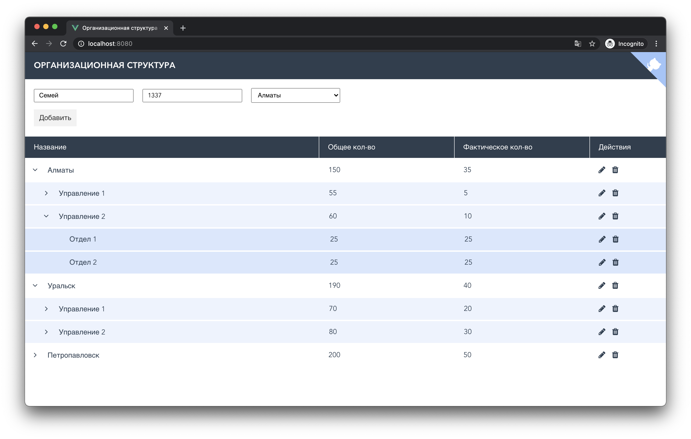

<h1 align="center">
  Avrora Holding test task
</h1>
<p align="center">
   Built with <a href="https://www.vuejs.org/" target="_blank">Vue</a> and hosted with <a href="https://www.netlify.com/" target="_blank">Netlify</a>
</p>
<p align="center">
  <a href="https://app.netlify.com/sites/dreamy-colden-c7c1ac/deploys" target="_blank">
    
  </a>
</p>



## 💻 Wanna run on your machine?

1. Clone the project

   ```sh
   git clone https://github.com/ironsoul0/avrora-holding.git
   ```

1. Install the dependencies

   ```sh
   cd avrora-holding
   npm install
   ```

3. Start the development server

   ```sh
   npm run serve
   ```